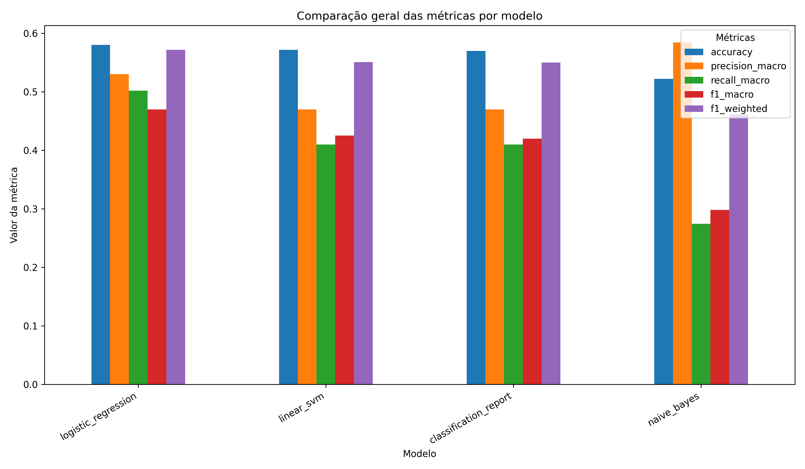

# 📰 ML News Classification

> Projeto em desenvolvimento para construção de um classificador de notícias usando Machine Learning, com foco em aprendizado prático de aplicações de ML e MLOps.

---

# 📌 Sobre o projeto

O **ML News Classification** é um projeto end-to-end de classificação automática de notícias.

O objetivo é construir uma pipeline completa de Machine Learning, passando por:

- Coleta e preparação dos dados
- Análise exploratória
- Pré-processamento textual
- Treinamento de modelos
- Avaliação de desempenho
- Comparação entre modelos
- Otimização de hiperparâmetros
- Versionamento de experimentos
- Organização do código para produção
- Práticas de MLOps

Este projeto ainda está em desenvolvimento e será evoluído de forma incremental.

---

# 🎯 Objetivos

- Aprender aplicações práticas de Machine Learning em NLP
- Criar um classificador de notícias por categoria
- Estruturar uma pipeline de ML reutilizável
- Aplicar boas práticas de MLOps
- Construir um projeto forte para portfólio

---

# 🧠 Problema

Dado o texto de uma notícia, o sistema deverá prever automaticamente sua categoria.

O texto utilizado para treinamento é formado pela combinação das colunas:

```python
headline + " " + short_description
````

A categoria da notícia é usada como variável alvo do modelo.

---

# 🗂️ Dataset

O projeto utiliza um dataset de notícias contendo informações como:

* Link da notícia
* Título
* Categoria
* Descrição curta
* Autor
* Data de publicação

Exemplo:

```json
{
  "headline": "Over 4 Million Americans Roll Up Sleeves For Omicron-Targeted COVID Boosters",
  "category": "U.S. NEWS",
  "short_description": "Health experts said it is too early to predict whether demand would match up with the new boosters."
}
```

---

# 🛠️ Stack utilizada

## Machine Learning e NLP

* Scikit-learn
* Pandas
* NumPy
* TF-IDF
* Logistic Regression
* Linear SVM
* Naive Bayes

## Visualização e análise

* Matplotlib
* Jupyter Notebook

## Persistência de modelos

* Joblib

## Qualidade e organização

* Ruff
* Black
* Pytest

## Futuras ferramentas de MLOps

* MLflow
* DVC
* Docker
* FastAPI

---

# 📁 Estrutura do projeto

```bash
ml-news-classification/
├── data/
│   ├── raw/
│   └── processed/
│       ├── train_processed.csv
│       └── test_processed.csv
├── models/
│   └── best_logistic_regression_model.joblib
├── notebooks/
├── reports/
│   ├── experiments/
│   ├── figures/
│   └── metrics/
├── src/
│   ├── data/
│   ├── evaluation/
│   └── models/
├── tests/
├── requirements.txt
├── README.md
└── .gitignore
```

---

# 🚧 Status do projeto

Projeto em andamento.

Atualmente, o projeto possui:

* Dataset carregado e analisado
* Pipeline TF-IDF implementado
* Baseline com Naive Bayes
* Modelos clássicos treinados
* Comparação entre modelos
* Avaliação com métricas de classificação
* Matriz de confusão
* Otimização inicial com GridSearchCV
* Rastreamento inicial de experimentos
* Comparação automática de métricas
* Geração automática de gráficos

---

# 📊 Resultados atuais

## Modelos avaliados

Até o momento foram avaliados:

* Naive Bayes
* Logistic Regression
* Linear SVM
* Logistic Regression com GridSearchCV

## Métricas utilizadas

As principais métricas usadas no projeto são:

* Accuracy
* Precision
* Recall
* F1-score macro
* F1-score weighted
* Confusion Matrix

O projeto prioriza o **F1-score macro**, pois o dataset possui desbalanceamento entre categorias.

---

# 📈 Comparação entre modelos

Abaixo está o gráfico consolidado de comparação entre os experimentos realizados até o momento.

## Comparação geral das métricas



---

# 🧪 Resultados parciais

## Baseline — Naive Bayes

* Accuracy no teste: **0.5221** 

## Logistic Regression

* Accuracy: **0.57**
* F1-score macro: **0.42**
* F1-score weighted: **0.55** 

## Linear SVM

* Accuracy: **0.58**
* F1-score macro: **0.43**
* F1-score weighted: **0.55** 

Até o momento, o **Linear SVM** apresenta o melhor desempenho geral considerando F1-score macro.

---

## 🔬 Semana 3 — Melhorias, experimentos, avaliação e rastreabilidade

### Melhorias implementadas

Durante a Semana 3 do projeto foram adicionadas melhorias importantes relacionadas à:

* otimização de hiperparâmetros;
* avaliação automatizada;
* comparação entre modelos;
* geração automática de gráficos;
* rastreabilidade e versionamento de experimentos.

---

###  Versionamento de experimentos

O projeto agora possui um sistema padronizado de rastreamento de experimentos.

Todos os treinamentos passam a gerar artefatos versionados automaticamente em:

```text
reports/experiments/
```

Cada execução gera um identificador único baseado em timestamp, modelo e tipo de experimento.

Exemplo:

```text
20260520_143210_naive_bayes_baseline.json
20260520_143355_logistic_regression_classic.json
20260520_143510_linear_svm_classic.json
20260520_144200_logistic_regression_gridsearch.json
```

---

### Estrutura padronizada dos experimentos

Os experimentos agora seguem uma estrutura organizada:

```text
reports/
├── experiments/
│   ├── 20260520_143210_naive_bayes_baseline.json
│   ├── 20260520_143355_logistic_regression_classic.json
│   ├── 20260520_143510_linear_svm_classic.json
│   ├── 20260520_144200_logistic_regression_gridsearch.json
│   │
│   ├── classification_reports/
│   ├── worst_categories/
│   └── cv_results/
│
├── figures/
└── legacy/
```
---

### Formato dos experimentos

Os experimentos são salvos em formato `.json`.

Exemplo simplificado:

```json
{
  "experiment_id": "20260520_143355_logistic_regression_classic",
  "model_name": "logistic_regression",
  "experiment_type": "classic",
  "created_at": "2026-05-20T14:33:55",
  "train_metrics": {},
  "test_metrics": {},
  "tfidf_params": {},
  "model_params": {},
  "artifacts": {}
}
```

---

### Comparação automática de métricas

Foi implementado um sistema automático de comparação entre modelos.

As métricas avaliadas são:

* Accuracy
* Precision macro
* Recall macro
* F1-score macro
* F1-score weighted

O projeto prioriza o **F1-score macro** devido ao desbalanceamento entre categorias.

---

### Gráficos automáticos

Os gráficos são gerados automaticamente em:

```text
reports/figures/
```

## Comparação geral das métricas


---

## Melhor modelo até o momento

Atualmente o melhor modelo considerando F1-score macro é:

### Linear SVM

Resultados atuais:

* Accuracy: ~0.58
* F1-score macro: ~0.43
* F1-score weighted: ~0.55

---

# 🚀 Como rodar o projeto

## 1. Clone o repositório

```bash
git clone https://github.com/seu-usuario/ml-news-classification.git
```

---

## 2. Acesse a pasta

```bash
cd ml-news-classification
```

---

## 3. Crie o ambiente virtual

```bash
python -m venv .venv
```

---

## 4. Ative o ambiente virtual

### Windows

```bash
.venv\Scripts\activate
```

### Linux/Mac

```bash
source .venv/bin/activate
```

---

## 5. Instale as dependências

```bash
pip install -r requirements.txt
```

---

# 🧪 Execução dos scripts

## Pré-processamento

```bash
python -m src.data.load_data
```

## Baseline — Naive Bayes

```bash
python -m src.models.train_naive_bayes
```

## Modelos clássicos

```bash
python -m src.models.train_classic_models
```

## GridSearchCV

```bash
python -m src.models.tune_model
```

## Comparação de métricas

```bash
python -m src.evaluation.compare_experiments
```
---

# 🤖 Modelos implementados

## Baseline

* Naive Bayes

## Modelos clássicos

* Logistic Regression
* Linear SVM

## Modelos otimizados

* Logistic Regression com GridSearchCV

---

# 📌 Roadmap

* [x] Setup inicial
* [x] Análise exploratória
* [x] Pipeline TF-IDF
* [x] Modelo baseline
* [x] Comparação entre modelos clássicos
* [x] Avaliação com métricas
* [x] Matriz de confusão
* [x] GridSearchCV
* [x] Rastreamento inicial de experimentos
* [x] Comparação automática de métricas
* [ ] MLflow
* [ ] DVC
* [ ] API com FastAPI
* [ ] Docker
* [ ] CI/CD
* [ ] Deploy

---

# 🌿 GitHub Flow

Este projeto segue o modelo **GitHub Flow**.

## Convenções de branches

* `feat/...`
* `fix/...`
* `docs/...`
* `refactor/...`
* `chore/...`

## Conventional Commits

* `feat:`
* `fix:`
* `docs:`
* `refactor:`
* `chore:`

---

# 📄 Licença

Projeto desenvolvido para fins de estudo, prática de Machine Learning e construção de portfólio.


Commit sugerido:

```bash
git add README.md
git commit -m "docs: update readme with week 2 progress"
````
